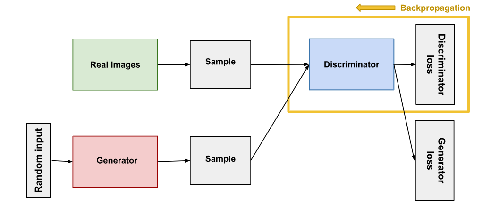

# GAN and Discriminator Implementation

This repository contains the implementation of a Generative Adversarial Network (GAN) and a Discriminator model using PyTorch. The project includes a U-Net-based generator and a custom discriminator with optional ActNorm layers.



## Table of Contents

- [Introduction](#introduction)
- [Features](#features)
- [Installation](#installation)
- [Usage](#usage)
- [Model Details](#model-details)
  - [Generator](#generator)
  - [Discriminator](#discriminator)
- [Example Output](#example-output)
- [License](#license)

---

## Introduction

Generative Adversarial Networks (GANs) are a class of machine learning frameworks where two neural networks, a generator and a discriminator, compete against each other. The generator creates fake data, while the discriminator tries to distinguish between real and fake data. This repository implements a GAN with a U-Net-based generator and a custom discriminator.

---

## Features

- **U-Net Generator**: A generator with skip connections for high-quality image generation.
- **Custom Discriminator**: A discriminator with optional ActNorm layers for normalization.
- **PyTorch Implementation**: Built using PyTorch for flexibility and scalability.
- **Example Workflow**: Demonstrates how to generate fake images and evaluate them using the discriminator.

---

## Installation

1. Clone the repository:
   ```bash
   git clone https://github.com/your-username/gan-discriminator.git
   cd gan-discriminator
   ```

2. install the required dependencies 
    ```python
        pip install torch torchvision torchsummary
    ```

### Usage 

1. Run the main script to test the generator and discriminator:
    ```python
        python discriminator.py
    ```

2. Modify the parameters in the `Discriminator` and `UNetGenerator` classes to experiment with different configurations.

## Model Details
### Generator
The generator is implemented as a U-Net with the following features:

- Input Channels: Configurable (default: 3 for RGB images).
- Output Channels: Configurable (default: 3 for RGB images).
- Downsampling: Reduces spatial dimensions while increasing feature channels.
- Residual Blocks: Adds skip connections for better gradient flow.
- Upsampling: Restores spatial dimensions to the original size.

See the implementation in [gan.py](https://github.com/ProgramerSalar/Discriminator/blob/master/gan.py).

### Discriminator
The discriminator is a convolutional neural network with the following features:

- Input Channels: Configurable (default: 3 for RGB images).
- Normalization: Supports BatchNorm or ActNorm.
- Output: A single-channel prediction map indicating real/fake probabilities.

See the implementation in [discriminator.py](https://github.com/ProgramerSalar/Discriminator/blob/master/discriminator.py).


## Example Output

Below is an example of how the discriminator processes input data and evaluates it:

### Example Code
```python
import torch
from discriminator import Discriminator

# Initialize the discriminator
discriminator = Discriminator(input_channels=3)

# Create a batch of fake images (e.g., 4 RGB images of size 256x256)
fake_images = torch.randn(4, 3, 256, 256)

# Pass the fake images through the discriminator
output = discriminator(fake_images)

# Print the output shape and example probabilities
print("Discriminator output shape:", output.shape)
print("Discriminator average `real` prob of `fake`:", output.mean().item())
```

Example Output

When running the above code, you might see output similar to this:

```
Discriminator output shape: torch.Size([4, 1, 16, 16])
Discriminator average `real` prob of `fake`: 0.123
```

This demonstrates how the discriminator evaluates the input images and outputs a probability map indicating the likelihood of the images being real or fake.


## License
This project is licensed under the MIT License. See the [LICENSE file](https://github.com/ProgramerSalar/Discriminator/blob/master/LICENSE) for details.
