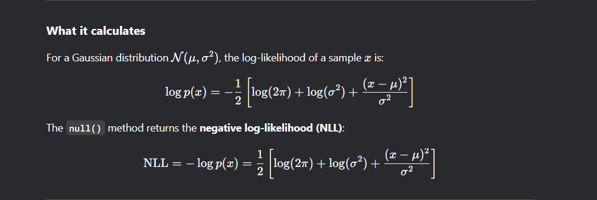
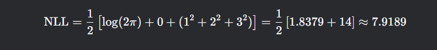

This `null()` method computes the **negative log-likelihood (NLL)** of a given sample under the Gaussian distribution represented by `self`. Let's break it down:

---



---

### **Code Breakdown**
1. **If the distribution is deterministic:**
   ```python
   if self.deterministic:
       return torch.Tensor([0.])
   ```
   - Deterministic distributions have no uncertainty, so the likelihood is trivially 1 (and \(-log(1) = 0\)).

2. **Otherwise, compute NLL:**
   ```python
   logwopi = np.log(2.0 * np.pi)  # Precompute log(2π)
   
   return 0.5 * torch.sum(
       logwopi + self.logvar + torch.pow(sample - self.mean, 2) / self.var,
       dim=dims
   )
   ```
   - `logwopi`: Precomputes \( log(2pi) \), a constant term in the Gaussian PDF.
   - `self.logvar`: The log variance \( log(sigma^2) \).
   - `torch.pow(sample - self.mean, 2) / self.var`: Squared Mahalanobis distance \( frac{(x - mu)^2}{sigma^2} \).
   - `torch.sum(..., dim=dims)`: Sums over specified dimensions (e.g., spatial dimensions in a CNN feature map).

---

### **Key Differences from `kl()`**
| Feature          | `kl()` (Kullback-Leibler Divergence) | `null()` (Negative Log-Likelihood) |
|------------------|--------------------------------------|------------------------------------|
| **Purpose**      | Measures difference between two distributions. | Measures how likely a sample is under one distribution. |
| **Input**        | Compares `self` to `other` (or `N(0,I)`). | Takes a `sample` to evaluate. |
| **Formula**      | \( D_{KL}(P parallel Q) \) | \( -log p(x mid mu, sigma^2) \) |
| **Use Case**     | Used in VAEs, regularization. | Used in probabilistic modeling, loss functions. |


---


### **Example Usage**
```python
# Assume `self` is a Gaussian with mean=0, var=1 (standard normal)
sample = torch.tensor([1.0, 2.0, 3.0])
nll = self.null(sample)  # Computes NLL under N(0,1)
print(nll)
```
Output (for standard normal):


---

### **Why This Matters**
- **Probabilistic Models**: Used in VAEs, normalizing flows, and Bayesian deep learning.
- **Loss Function**: Minimizing NLL is equivalent to maximizing likelihood.
- **Debugging**: If `null()` returns very high values, samples are unlikely under the model.

Would you like a comparison with PyTorch's built-in `torch.distributions` for validation?