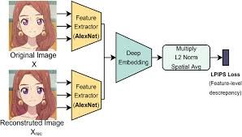

# LPIPS - Learned Perceptual Image Patch Similarity

This repository implements the LPIPS metric, a perceptual similarity metric for comparing images. The LPIPS metric is widely used in image generation and restoration tasks to evaluate the perceptual quality of images.

.jpeg>)


## Features

- **VGG-based Feature Extraction**: Uses a pre-trained VGG16 model to extract multi-level features.
- **Learned Linear Layers**: Applies learned weights to compute perceptual similarity.
- **Pre-trained Weights**: Includes pre-trained weights for LPIPS computation.
- **Utility Functions**: Includes helper functions for downloading and verifying model checkpoints.

## Installation

1. Clone the repository:
   ```bash
   git clone https://github.com/ProgramerSalar/LPIPS.git
   cd LPIPS
   ```

2. Install the required dependencies:
   ```python
   pip install -r requirements.txt
   ```

## Usage

### Compute LPIPS Distance

You can compute the perceptual distance between two images using the LPIPS class:

```python
import torch
from lpips import LPIPS

# Create sample images
img1 = torch.randn(1, 3, 256, 256)
img2 = torch.randn(1, 3, 256, 256)

# Compute perceptual distance
lpips = LPIPS().eval()
distance = lpips(img1, img2)
print(f"Perceptual distance: {distance.item():.4f}")
```

### Load Pre-trained Model

To use the pre-trained LPIPS model:

```python
from lpips import LPIPS

lpips_model = LPIPS.from_pretrained('vgg_lpips')
distance = lpips_model(img1, img2)
print(f"LPIPS distance: {distance.item():.3f}")
```

## File Structure
```
Lpips/
├── .gitignore
├── assets/                # Folder for storing images and other assets (ignored by Git)
│   ├── download (1).jpeg
│   ├── download.jpeg
│   └── lpips_example.png  # Example image for the Readme (if added)
├── lpips.py               # Implements the LPIPS model and its components
├── utils.py               # Utility functions for downloading and verifying model checkpoints
├── vgg.pth                # Pre-trained weights for the LPIPS model
├── example.txt            # Example file for testing purposes
├── requirements.txt       # Dependencies for the project
└── Readme.md              # Project documentation
```
## License
This project is licensed under the MIT License. See the LICENSE file for details.

## References
- [LPIPS: The Unreasonable Effectiveness of Deep Features as a Perceptual Metric](https://arxiv.org/abs/1801.03924)